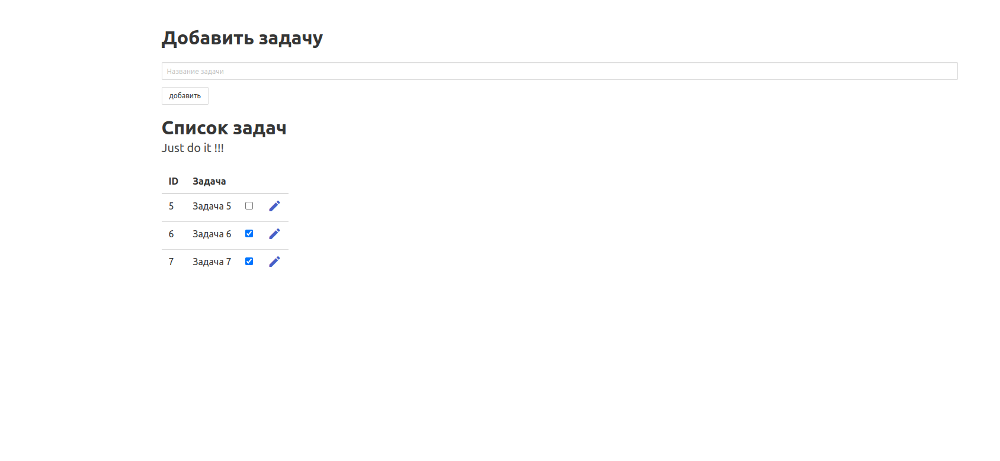
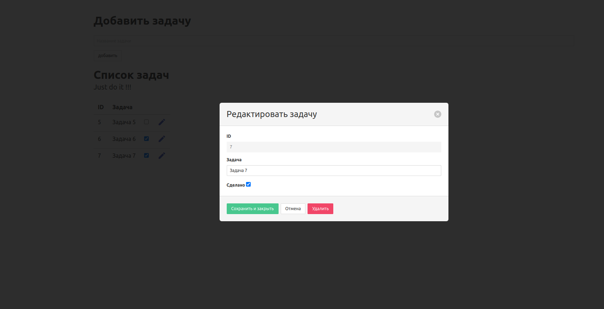

# Запуск

```
docker-compose up
# после запуска всех контейнеров
# найти контейнет php
docker ps
# подключиться к bash
# пример
docker exec -it phptesttask_php_1 bash
composer install
```

открыть ссылку 
```
http://localhost:8002/migrate
```
для создания бд и таблицу

открыть http://localhost:8002


# пример


